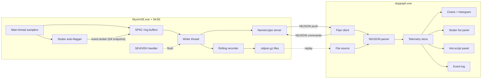

# Skygraph: Real-Time Skyrim Telemetry

## Primary Use Case

A user reports stutter or framedrops "in certain conditions" (e.g. crossing into Whiterun, during combat, when fast-traveling). Skygraph must let them — or a mod author helping them — answer:

1. **When** did it stutter? (frame-time chart + auto-flagged stutter list)
2. **Which subsystem** was unusually slow on that frame? (per-subsystem CPU breakdown: Papyrus / Havok / AI / render submit / streaming / other)
3. **What was happening in the game** at that exact moment? (in-flight cell load, hot Papyrus scripts, actor counts, VRAM headroom, page-fault burst, streaming queue depth - all captured in the stutter event's context snapshot)
4. **Reproducibility**: load the recorded session into the viewer, scrub the timeline, see if the pattern repeats.

The entire architecture (per-frame samplers, stutter auto-flagger, full-context snapshots, replay mode) is shaped around answering these four questions.

## Architecture



## Pinned Decisions

- **IPC**: Windows named pipe `\\.\pipe\skygraph`, duplex, plugin = server. Multiple viewer connections supported via multiple pipe instances.
- **Wire format**: NDJSON, one JSON object per pipe message. Schema version constant in `protocol/include/skygraph/protocol/version.h`; viewer refuses to connect on mismatch.
- **Viewer tech**: C++23 + Dear ImGui (docking branch) + ImPlot + DX11. Single statically-linked exe, no runtime deps.
- **Telemetry scope (maximal + stutter diagnosis)**: frame, per-subsystem CPU breakdown (Papyrus/Havok/AI/render submit/streaming/other), memory + pressure (page faults, commit charge), VRAM, full Papyrus VM (incl. per-script and per-function CPU time, a live per-stack monitor with state + time-in-state, and a session-cumulative profiler), game state, actor counts, events (cell/save/mod with timed cell-load durations), GPU timestamp queries, resource-streaming hitches, SEH/VEH crash handler.
- **Papyrus control plane (opt-in)**: the viewer can request a full stack-trace dump for any live stack (read-only), and — only when `papyrus.allow_vm_control` is enabled (default off) — issue a Force Return to unstick a latent-waiting stack. This is the one place skygraph deliberately steps beyond read-only telemetry; it is gated, defaulted off, and warned about in both UI and log.
- **Stutter diagnosis (primary use case)**: plugin maintains rolling p50 of frame_ms; any frame > Nx p50 (default 2.5) emits `event.stutter` carrying a full context snapshot. Viewer surfaces a Stutter list, frame-time histogram, and 1% / 0.1% lows.
- **Config**: `SKSE/Plugins/skygraph.json` next to the DLL, loaded once at plugin init. No protocol-driven subscription.
- **Recording**: rolling gzipped NDJSON in `Documents/My Games/Skyrim Special Edition/SKSE/skygraph/`, default 5 min cap. Viewer "Save session" button sends a command upstream to pin the current rolling window with a permanent filename.
- **UI**: ImGui docking branch; ship default layout as `imgui.ini.default`, user changes persist to `imgui.ini`.
- **Repo**: monorepo, three CMake subprojects (`protocol/` INTERFACE, `plugin/`, `viewer/`).
- **Threading**: main-thread sampler -> per-group lock-free SPSC ring buffer -> single writer thread -> pipe + recorder. Drop-oldest on overflow. Game thread never blocks on I/O.

## Telemetry Catalog

- **frame** (per-frame, ~60 Hz): `dt_ms`, `fps`, `cpu_frame_ms`, `gpu_frame_ms`
- **cpu_breakdown** (per-frame, ~60 Hz): `papyrus_ms`, `havok_ms`, `ai_ms`, `render_submit_ms`, `streaming_ms`, `other_ms` (each derived from QPC-bracketed hooks; missing/unflagged subsystems roll into `other_ms`)
- **memory** (1 Hz): `working_set_mb`, `private_mb`, `vram_used_mb`, `vram_budget_mb`
- **memory.pressure** (1 Hz): `page_faults_per_sec`, `commit_charge_mb`, `commit_limit_mb`
- **papyrus.snapshot** (10 Hz): `active_stacks`, `suspended_stacks`, `latent_queue_depth`
- **papyrus.top** (10 Hz): top-N hot scripts `[{name, us_window, calls_per_sec, pct_frame}]`
- **papyrus.stacks** (10 Hz): live stack monitor — per-stack `[{stack_id, script, function, state, active_ms}]` where `state` ∈ {`Running`, `WaitLatent`, `WaitCall`, ...} and `active_ms` is time held in the current state (for the sortable / filterable / prefix-grouped table)
- **papyrus.profile** (1–2 Hz, session-cumulative): per-function `[{script, function, calls, total_us, avg_us, max_us}]`; cleared by `reset_profile`
- **papyrus.stack_trace** (response to `dump_stack`): `{stack_id, frames:[{script, function}], text}` — also written to `skygraph.log`
- *(Total VM Execution graph reuses `cpu_breakdown.papyrus_ms`; the viewer derives the rolling average + peak over a trailing window — no new record needed.)*
- **state** (2 Hz): `cell_name`, `worldspace`, `player_pos[3]`, `actor_counts{high, mid_high, mid_low, low}`, `loaded_refs`
- **streaming** (2 Hz): `queue_depth`, `bytes_per_sec`, `in_flight_requests`
- **event.cell_attach / cell_detach** (as-they-happen): now include `duration_ms`
- **event.save / autosave / mod_event / crash** (as-they-happen)
- **event.streaming_hitch** (as-they-happen): individual streaming request exceeding threshold
- **event.stutter** (as-they-happen): `{frame_ms, p50_ms, ratio, snapshot:{cpu_breakdown, cell, in_flight_cell_load, top_papyrus[], actor_counts, vram_headroom_mb, page_faults_per_sec, streaming_queue_depth}}`
- **plugins** (one-shot at handshake): active load order with masters
- **hello** (one-shot per connection): `{protocol_version, plugin_version, game_runtime}`

## Protocol Sketch

Server -> client push (one record per `WriteFile` call, newline-terminated):

```json
{"t":1716913456.123,"type":"frame","dt_ms":16.42,"fps":60.9,"cpu_frame_ms":12.1,"gpu_frame_ms":11.8}
{"t":1716913456.123,"type":"cpu_breakdown","papyrus_ms":1.8,"havok_ms":2.4,"ai_ms":3.1,"render_submit_ms":2.6,"streaming_ms":0.3,"other_ms":1.9}
{"t":1716913456.130,"type":"papyrus.snapshot","active":42,"suspended":3,"latent":1}
{"t":1716913456.131,"type":"papyrus.top","scripts":[{"name":"WICasterAlias","us_window":12300,"cps":4.0,"pct_frame":0.7}]}
{"t":1716913456.131,"type":"papyrus.stacks","stacks":[{"stack_id":1837,"script":"WICasterAlias","function":"OnUpdate","state":"Running","active_ms":3.2},{"stack_id":1840,"script":"DLC1NPCMonitor","function":"RegisterForUpdate","state":"WaitLatent","active_ms":812.5}]}
{"t":1716913456.500,"type":"papyrus.profile","functions":[{"script":"WICasterAlias","function":"OnUpdate","calls":1840,"total_us":920000,"avg_us":500,"max_us":11200}]}
{"t":1716913457.010,"type":"papyrus.stack_trace","stack_id":1837,"frames":[{"script":"WICasterAlias","function":"OnUpdate"},{"script":"WIInternal","function":"DispatchUpdate"}],"text":"WICasterAlias.OnUpdate <- WIInternal.DispatchUpdate"}
{"t":1716913456.140,"type":"event.cell_attach","cell":"Whiterun","duration_ms":47.2}
{"t":1716913456.190,"type":"event.stutter","frame_ms":83.4,"p50_ms":16.7,"ratio":5.0,"snapshot":{"cpu_breakdown":{"papyrus_ms":2.1,"havok_ms":12.3,"ai_ms":58.0,"render_submit_ms":3.0,"streaming_ms":6.2,"other_ms":1.8},"cell":"Whiterun","in_flight_cell_load":"WhiterunOrigin","top_papyrus":[{"name":"WICasterAlias","us":4200}],"actor_counts":{"high":42,"mid_high":18,"mid_low":7,"low":120},"vram_headroom_mb":420,"page_faults_per_sec":3200,"streaming_queue_depth":24}}
```

Client -> server commands:

```json
{"cmd":"save_session","name":"my-test-run"}
{"cmd":"ping"}
{"cmd":"dump_stack","stack_id":1837}
{"cmd":"force_return","stack_id":1840}
{"cmd":"reset_profile"}
```

`force_return` is honored only when `papyrus.allow_vm_control` is `true` in `skygraph.json`; otherwise the plugin rejects it and replies with an `ack` carrying an `error`.

## Repo Layout

```
skygraph/
  .cursor/rules/skse-mod-development.mdc        (already exists)
  CMakeLists.txt, CMakePresets.json, vcpkg.json, .gitignore, README.md
  protocol/                INTERFACE target
    include/skygraph/protocol/{version,messages,pipe}.h
    docs/protocol.md
  plugin/                  SKSE DLL (skygraph.dll)
    src/
      plugin.cpp           SKSEPluginLoad entry
      samplers/            frame, cpu_breakdown, memory, papyrus, state, render, streaming, events
      diagnostics/         stutter_flagger.{h,cpp} (rolling p50 + context snapshot)
      transport/           ring_buffer, writer_thread, pipe_server, rolling_recorder
      crash/seh_handler.{h,cpp}
      config/plugin_config.{h,cpp}
  viewer/                  Standalone exe (skygraph.exe)
    src/
      main.cpp, app.{h,cpp}
      transport/{pipe_client, ndjson_source}.{h,cpp}
      state/{telemetry_store, script_table, stutter_log}.{h,cpp}
      panels/{status_bar, charts_panel, breakdown_panel, papyrus_panel, stack_monitor_panel, script_profiler_panel, vm_exec_panel, stutter_panel, events_panel, plugins_panel, timeline_panel}.{h,cpp}
    resources/{imgui.ini.default, icon.ico}
  tools/pipe_tail.py       debug: dump raw NDJSON from pipe
  docs/{architecture, installation, packaging}.md
```

## Key Dependencies (vcpkg manifest)

- **Plugin**: `commonlibsse-ng`, `nlohmann-json`, `spdlog`, `zlib`
- **Viewer**: `imgui[docking-experimental,dx11-binding,win32-binding]`, `implot`, `nlohmann-json`, `spdlog`, `zlib`
- **Shared**: `fmt`

## Packaging

- `skygraph-plugin-vX.Y.Z.7z` (MO2-friendly): `SKSE/Plugins/skygraph.dll` + `SKSE/Plugins/skygraph.json`
- `skygraph-viewer-vX.Y.Z.zip`: `skygraph.exe` + `imgui.ini.default` + `README.txt`
- Shared version; protocol version in `protocol/include/skygraph/protocol/version.h` gates compatibility at handshake.

## Risks (explicit mitigations baked in)

- **Papyrus VM hook** (per-script CPU time): Address-Library-resolved hook on the VM's stack run/yield pair, bracketed with `QueryPerformanceCounter`. Mitigation: unit-test harness with a hand-rolled mock VM proves attribution math in isolation before the live hook is flipped on; feature-flagged in config.
- **CPU breakdown hooks (Havok / AI / render submit)**: four additional Address-Library hook sites, any of which can fail on a runtime update. Mitigation: each subsystem hook is independently feature-flagged; on resolve failure, its time rolls silently into `other_ms` (no crash, just a less-detailed breakdown).
- **Resource streaming hook (highest fragility)**: BSResource path touches the renderer's I/O. Mitigation: feature-flagged off by default in `skygraph.json`; viewer surfaces "streaming sampler disabled" hint in the breakdown panel so users know what's missing.
- **GPU timestamp queries**: hooking the DX11 present chain - a bad hook crashes the game on first frame. Mitigation: feature-flagged off by default; standalone smoke harness validates the hook outside Skyrim first.
- **Stutter-flagger overhead**: per-frame p50 computation + snapshot allocation could itself stutter if naive. Mitigation: rolling p50 uses an order-statistic ring (no sort), snapshot uses a preallocated arena reused across stutter events.
- **SEH/VEH crash handler ordering**: must install after any third-party handler (NetScriptFramework, etc.) to chain correctly. Mitigation: install at the very end of `SKSEPluginLoad`, document load-order interactions, support chaining to a prior handler.
- **Pipe backpressure**: viewer paused/slow could fill OS pipe buffer. Mitigation: writer thread uses overlapped I/O with a short timeout; on timeout, drop oldest records from the ring instead of blocking.
- **Live stack enumeration**: walking the VM's running/suspended/latent stack lists every 10 Hz races against the VM mutating them on the game thread. Mitigation: enumerate under the VM's own lock where available, copy out only POD fields (ids, names, state, timestamps) into the ring, and wrap the whole read in try/catch so a transient bad layout degrades to a skipped tick rather than a crash (same fail-soft contract as the counters).
- **Force Return mutates VM state** (the one non-read-only feature): forcing a latent stack to return can corrupt mod logic or a save if misused. Mitigation: gated behind `papyrus.allow_vm_control` (default **off**); when off the command is rejected with an `ack.error`; when on, the viewer shows an explicit warning affordance and every Force Return is logged with the target stack id, script, and function. Stack-trace dump (`dump_stack`) is read-only and always available.
